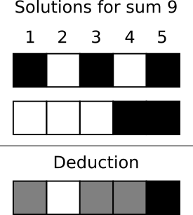

Program solving random kakurasu
===============================

A kakurasu is an n rows by m colums grid puzzle. The goal of the puzzle is to determine the black or 
white color of all cells by using the sums of weight of black cells in all rows and columns. The 
weight is a number from 1 to n. 
 
The image bellow shows a solved kakurasu. The numbers on the top and left sides are the row and column
weight. The numbers on the right and at the bottom are the sums of weight.

Solving algorithm
-----------------

Each sum has a limited set of possible weight combinations. From this set of possible solutions we can
deduce that some cells must be white and others must be black because they are respectively white or 
black in all solutions. The image below illustrate the deduction we can make from the sum 9. A cell
color is grey when it’s color is unknown from the deduction.

Once we deduced the color of a cell, we can prune solutions of the row or column that have 
an incompatible color for that cell. For instance, when deducing the cell colors of a row, we need 
only to prune the solutions of the column that contain the cell whose color has been determined. Same 
for columns. 

By repeating the deduction and pruning operations, we can deduce the color of the grid cells. This deduction
process will end when the color of all cells has been determined or no more deductions can be made. In the 
later case we are left with cells of unknowr color, which means that there are multiple solutions where 
the cells of unknown color are black or white.

To find the different solutions, we assign the color white to a cell of unknown color and solve by 
deduction, and we assign the color black and solve again by deduciton. By repeating this process we may find
two or more solutions.  
