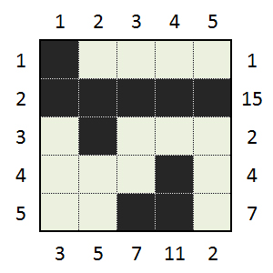

Program solving random kakurasu
===============================

A kakurasu is a nxm grid (n rows, m colums), with each column and row given a weight from 1 to n or m. 
Cells are black or white. As input we get the sum of wheigt of black cells in rows and column. The goal 
of the puzzle is to determine from the sums which cell is black and which cell is white. 

The image bellow shows a solved kakurasu. 

